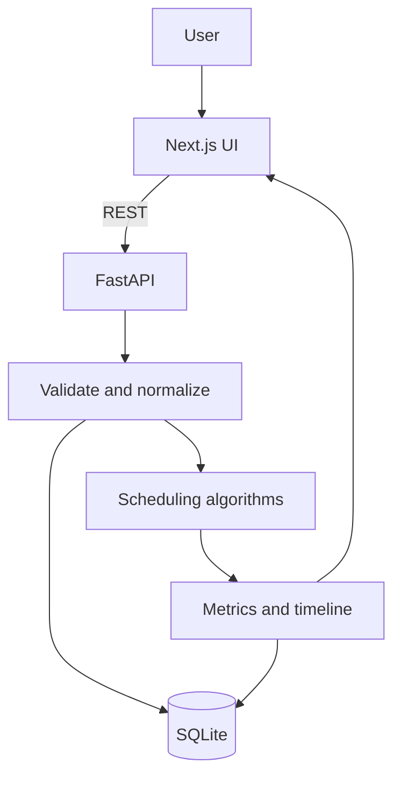

# Architecture

```mermaid
flowchart TD
 U[User] --> F[Next.js UI]
 F -->|REST| A[FastAPI]
 A --> V[Validate and normalize]
 V --> D[(SQLite)]
 V --> S[Scheduling algorithms]
 S --> M[Metrics and timeline]
 M --> D
 M --> F
```
